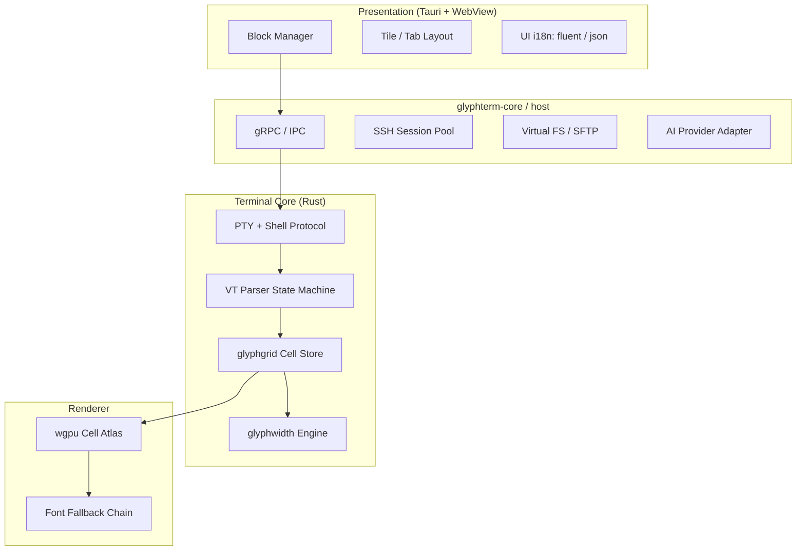

# GlyphTerm 系统架构

## 1. 设计目标

1. **正确性优先**：终端网格上每一个码点的列宽必须符合 [UAX #11](https://www.unicode.org/reports/tr11/) 与项目策略，并通过可回归的黄金测试。
2. **本地优先**：会话、历史、密钥材料默认留在用户机器；AI 与云功能可插拔、可关闭。
3. **块化工作区**：终端不是单窗口，而是可组合的 Block（终端、编辑、预览、网页等块可自由排布）。
4. **跨平台**：macOS / Linux / Windows 共用同一套 Rust 核心库；UI 采用 Tauri，便于统一字体与渲染行为。

## 2. 逻辑分层



### 2.1 glyphwidth（宽度真理源）

- 输入：UTF-8 字符串 + **WidthPolicy**（见 `CJK-RENDERING.md`）
- 输出：每个 `GraphemeCluster` 的 `cols: u8`（0/1/2）与 `kind`（宽/窄/零宽/控制）
- **禁止** UI 层自行 `str.len()` 或按 code point 数算列
- 与 `unicode-width` / ICU 同步 Unicode 版本；Ambiguous 宽度由策略开关，不随系统 locale 静默变化

### 2.2 glyphgrid（单元格网格）

- 存储：`Vec<Cell>`，每格 `char + fg/bg + attrs + wide_continuation`
- 宽字符占 2 列：主格存字形，副格标记 `WideContinuation`
- 光标、选区、滚动、换行均以 **列** 为单位
- API：`insert_grapheme`, `resize(cols, rows)`, `line_wrap`

### 2.3 glyphvt（VT 解析器）

-  crate：`crates/glyphvt`，状态机：CSI / ESC，兼容主流 VT 转义子集
- 与 grid 解耦：解析器输出 `Action` 枚举，由 `apply()` 写入网格
- 已实现：光标定位 (CUP)、擦除 (EL/ED)、基础 SGR 颜色
- 待实现：OSC、Bracketed paste、鼠标、256/true color

### 2.4 Host 服务

| 模块 | 职责 |
|------|------|
| Session | 本地/SSH PTY 生命周期 |
| Connection | 主机配置、密钥、跳板 |
| FileIndex | 远程目录缓存、预览 MIME 路由 |
| Config | 单一 `glyphterm.toml`，含字体与 `width_policy` |
| Plugin | Widget HTML 沙箱（后期） |

### 2.5 UI Block 类型

| Block | 后端 |
|-------|------|
| `terminal` | Core PTY stream |
| `editor` | LSP 可选，Monaco/CodeMirror |
| `preview` | 同屏 MD/图片/CSV |
| `web` | WebView2 / WKWebView |
| `ai` | OpenAI-compatible API |

## 3. 渲染策略

- **Phase 1**：Rust 网格 + 平台原生文本绘制（macOS Core Text / 跨平台 fontdue）
- **Phase 2**：GPU 字形图集，统一度量与回退
- 列宽、字素簇、宽字符续格均在核心层完成，避免 UI 与核心各算一套宽度

## 4. 数据流（单终端块）

```
Shell stdout (UTF-8 bytes)
  → VT Parser
  → TerminalAction::Print(graphemes)
  → glyphwidth::measure(policy)
  → glyphgrid::write
  → Render diff (dirty rects)
  → GPU / Text layout
```

## 5. 配置模型（草案）

```toml
[terminal]
font_family = "Sarasa Mono SC"
font_size = 14
line_height = 1.2

[unicode]
# narrow | wide | auto（跟随 locale，不推荐默认）
ambiguous_width = "narrow"
emoji_width = "wide"
legacy_combining_mode = false

[i18n]
ui_locale = "zh-Hans"  # en | zh-Hans | ja
```

## 6. 测试策略

| 层级 | 内容 |
|------|------|
| glyphwidth | 黄金文件：中日韩、组合 emoji、ZWJ、Ambiguous 符号 |
| glyphgrid | 光标/选区/换行/宽字符删除 |
| VT | 字节流回放测试 |
| E2E | `script` 录制 + 像素/文本快照（后期） |

## 7. 安全

- SSH 密钥 OS keychain 存储
- Widget 块默认 CSP 限制
- AI 块显式声明出站域名

## 8. 开源与治理

- License: Apache-2.0
- `CODEOWNERS` 核心 crate 需 2 review
- RFC 目录：`docs/rfcs/` 用于宽度策略、协议变更
